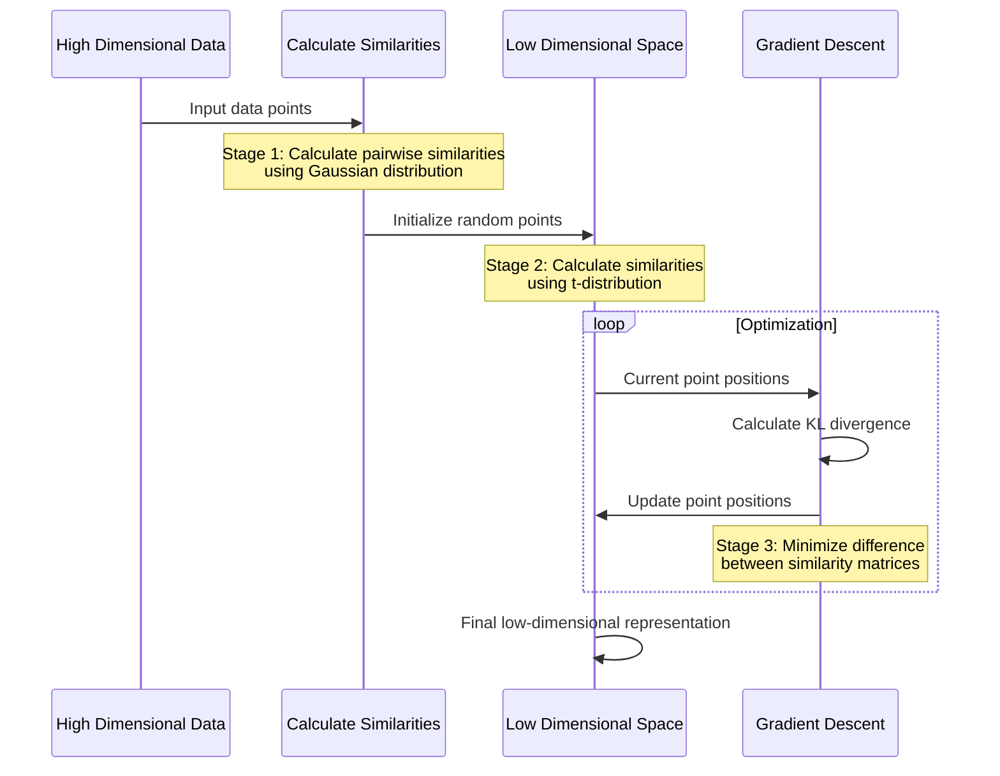

# Homework 1

### Resources

https://medium.com/@sachinsoni600517/mastering-t-sne-t-distributed-stochastic-neighbor-embedding-0e365ee898ea

https://www.youtube.com/watch?v=NEaUSP4YerM

# t-SNE

## Introduction

The core idea behind t-SNE is to map high-dimensional data points to a lower-dimensional space, typically two or three dimensions, in a way that **preserves the local relationships between points.** It achieves this by **measuring the similarity between data points in the high-dimensional space and representing this similarity as probabilities**. Then, it constructs a similar probability distribution in the lower-dimensional space and minimizes the difference between the two distributions using a technique called gradient descent.

## Calculate Similarity

### Stage - 1

One approach is to compute the distance between points, but this method becomes **less reliable in higher dimensions due to the “curse of dimensionality.”** Instead of relying solely on distance calculations, t-SNE utilizes a probabilistic approach. For each data point, such as x1, a Gaussian distribution is plotted around it with a mean of zero, and the standard deviation is determined based on the density of nearby points around x1.

Now, on the x-axis, we consider distances from a reference point, such as x1. For each point in the dataset, we calculate its distance to x1 and plot these distances along the x-axis. The y-axis represents the corresponding probability density, allowing us to determine the probability of each data point relative to x1, which serves as the similarity score for that point.

Similarly, this method is applied to each point in the dataset, resulting in an n * n matrix where the similarity score for each data point is recorded relative to every other data point. 

### stage - 2

Now we reduce the higher dimension into lower dimension and points are randomly distributed on x -axis

At this stage, we recalculate the similarity score for each point relative to others, resulting in another n * n matrix. We now have two matrices: one representing the similarity scores in the higher dimension and another representing the similarity scores in the lower dimension.

### Stage - 3

To preserve the local relationships between points, ensuring that neighboring points remain close in the lower dimension, we aim to align the lower-dimensional matrix with the higher-dimensional one. This alignment involves adjusting the position of points iteratively until the similarity matrix in the lower dimension resembles the one in the higher dimension as closely as possible.

## Objective Function

We want to minimize the difference between the similarities of points in the high-dimensional space and their counterparts in the low-dimensional space. We measure this difference using the **Kullback-Leibler (KL) divergence**.

The KL divergence measures how one probability distribution diverges from another. In our case, it quantifies how different the pairwise similarities are between the high-dimensional and low-dimensional spaces.

The KL divergence in t-SNE is mathematically defined as:

$$
KL(P||Q) = \sum_i \sum_j p_{ij} \log \frac{p_{ij}}{q_{ij}}
$$

Where:

- $p_{ij}$ represents the similarity between points i and j in the high-dimensional space
- $q_{ij}$ represents the similarity between points i and j in the low-dimensional space

The goal is to minimize this divergence through gradient descent, which effectively aligns the low-dimensional representation with the high-dimensional structure of the data.

## Algorithm

## Notes

### Computing Similarities

- For each data point in the high-dimensional space, we calculate its similarity to every other point using a Gaussian distribution. This similarity is based on the distance between points.
- Similarly, in the low-dimensional space, we calculate similarities between points using a t-distribution.

<aside>
💡

Without the t-distribution the clusters would all clump up in the middle and be harder to see

The t-distribution is used in the low-dimensional space instead of a Gaussian distribution for a few key reasons:

- It has heavier tails than the Gaussian distribution, which means it spreads out points more effectively in the lower-dimensional space
- This heavier tail property helps prevent the "crowding problem" where too many points get clustered in the center of the visualization, as noted in the context

In more detail:

- The t-distribution gives more space to distant points in the low-dimensional representation, making it easier to see distinct clusters
- When points are moderately far apart in the high-dimensional space, they can still maintain meaningful distances in the low-dimensional space, rather than being forced too close together
- This helps preserve both the local and global structure of the data, making the final visualization more interpretable and meaningful
</aside>

<aside>
💡

The symmetrized probability (pij) in t-SNE is calculated using the formula:
$pij = \frac{(pi|j + pj|i)} {(2n)}$

</aside>